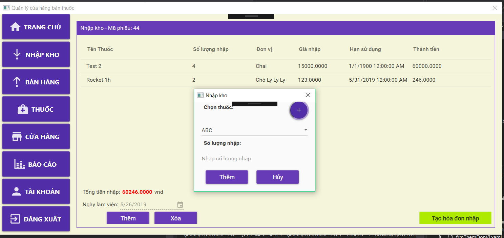
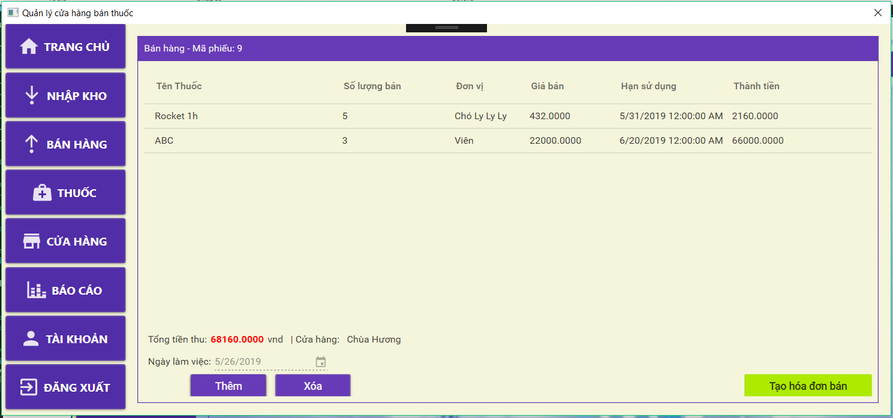
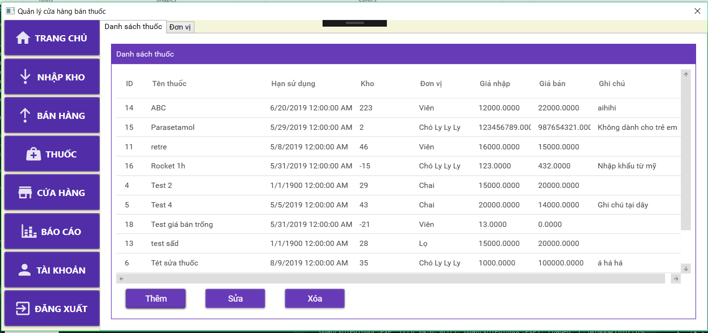
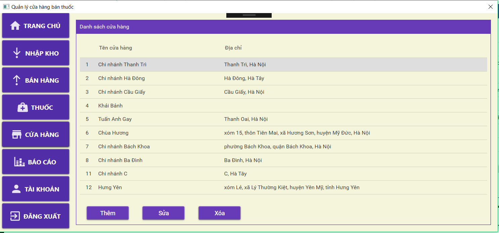
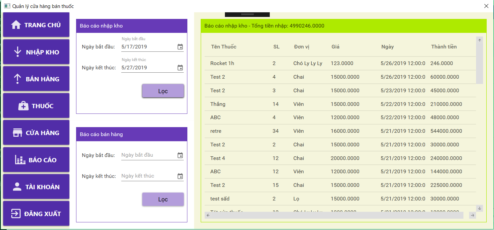
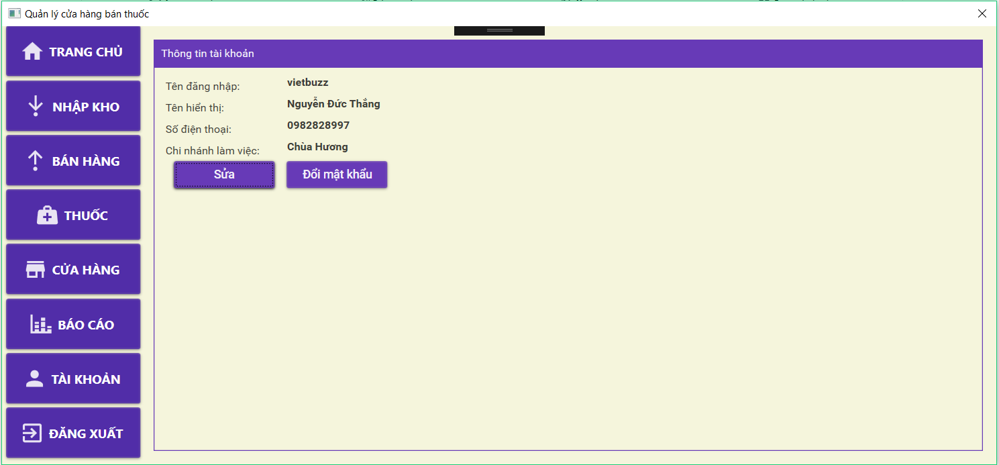

# QuanLyHieuThuocV1
Quản lý hiệu thuốc C# wpf  
Hướng dẫn:   
Tải file nén về giải nén, cài CSDL mới theo file create_database  
Chỉnh thông số cấu hình kết nối SQL trong file Dataprovider.cs  
Một số ảnh chụp chương trình:  
 
 
 
 
 
 
 
 
